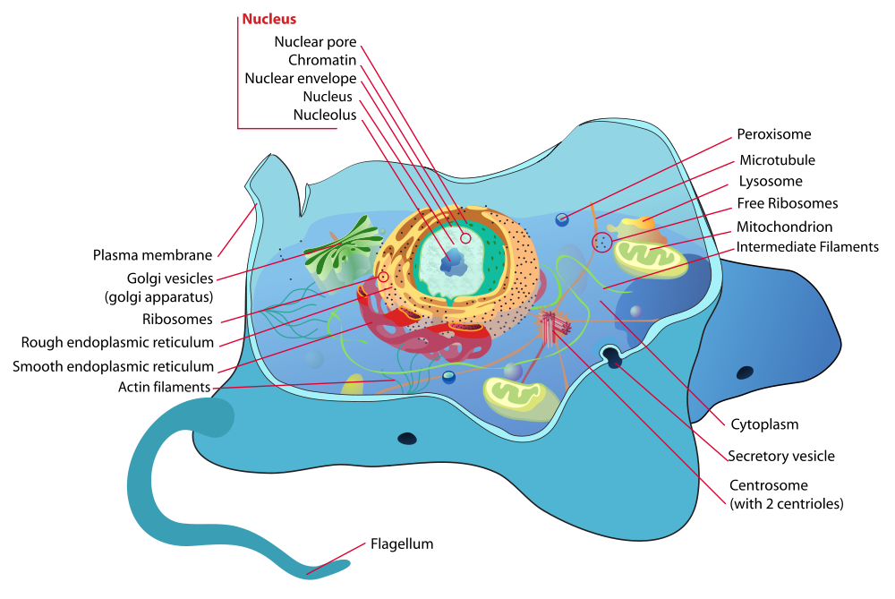
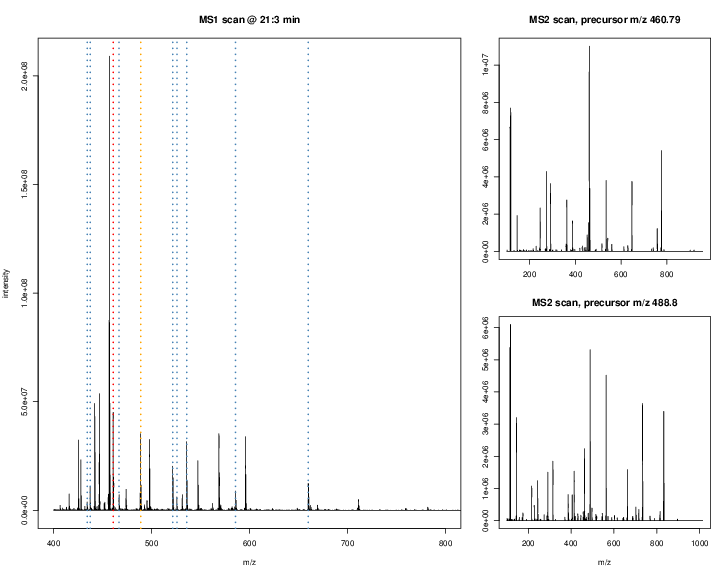

This material available under a [**creative common
CC-BY**](http://creativecommons.org/licenses/by/4.0/) license. You are
free to **share** (copy and redistribute the material in any medium or
format) and **adapt** (remix, transform, and build upon the material)
for any purpose, even commercially.

# Biological information flow 

```{r infoflow, results='markup', fig.margin=TRUE, fig.cap="Information flow in biological systems (Source *Central dogma of biology* on Wikipedia).", fig.width=5, fig.height=5, echo=FALSE}
knitr::include_graphics("figure/centraldogma.png")
```

There are three main biological entities that respectively store
information, act as data intermediates, and the functional units, and
the figure below show how information flows between these three
levels.


**DNA**, that lives in the nucleus of cells, is the central
information storage mechanism, and encodes the blueprint of the
functional units as genes. DNA is **transcribed** into **messenger
RNA** (mRNA), that re-localises outside the nucleus and is further
processed into its mature *exon*-only form after removal of the
non-coding *introns* sequences. Finally, the mRNA is translated by the
ribosomial machinery into **proteins** directly into the endoplasmic
reticulum (ER) where they are then redirected to their final
destination. 

```{r cell, results='markup', fig.margin=FALSE, fig.cap="Sub-cellular structure of an animal cell (Source *Cell biology* on Wikipedia).", fig.width=5, fig.height=5, echo=FALSE}

```
In addition to the standard information worflow where DNA is
transcribed into RNA that itself is translated into proteins,
information flow, there is also reverse transcription, that generates
(complementary) DNA from and RNA molecule, as well as replication of
DNA (during cell division) and RNA molecules.


# Why studying proteins

Proteins as the functional units in all living organisms, and they are
highly dynamic. The caterpillar and the resulting butterfly have the
same genome. The complement of all the expressed proteins, termed the
proteome is however very different.


```{r metam, results='markup', fig.margin=FALSE, fig.cap="The metamorphosis from a caterpilar to a monarch butterfly. (Image from Phys.prg)", fig.width=5, fig.height=5, echo=FALSE}

```

There are different modalities of the proteome that are of
interest. In addition to the presence or amount of protein in a
biological samples, it is also important to study the interactions
between proteins forming protein-protein complexes, the presence of
post-transcriptional modification (such as, for example,
phosphorylations), the rate at which proteins are produced and
degrated, or where the proteins reside inside a cell. 

The technique of choice to study proteins in a high throughput way is
*mass spectrometry*.

# Setup

```{r sticker, fig.cap = "The `MSnbase` package.", out.width = '50%', fig.margin=TRUE, echo=FALSE}

```

We are going to use the Bioconductor [@Huber:2015] `MSnbase` package
[@Gatto:2012], which can be install with the `BiocManager` package,
available from CRAN. If `BiocManager` isn't available on your
computer, install it with:


```{r setup1, eval = FALSE}
install.packages("BiocManager")
```

Now, install `MSnbase` and its dependencies with 

```{r setup2, eval = FALSE}
BiocManager::install("MSnbase")
```

For additional information on how to analyse mass spectrometry-based
proteomics data, refer to [@Gatto:2014] and [@biocmsprot], or explore
the the
[proteomics-](http://bioconductor.org/packages/release/BiocViews.html#___Proteomics)
and [mass
spectrometry-](http://bioconductor.org/packages/release/BiocViews.html#___MassSpectrometry)related
packages on the Bioconductor page


# How does mass spectrometry work?

Mass spectrometry (MS) is a technology that *separates* charged
molecules (ions) based on their mass to charge ratio (M/Z). It is
often coupled to chromatography (liquid LC, but can also be gas-based
GC). The time an analytes takes to elute from the chromatography
column is the *retention time*.


```{r chrom, results='markup', fig.margin=FALSE, fig.cap="A chromatogram, illustrating the total amount of analytes over the retention time.", echo=FALSE}
knitr::include_graphics("./figure/chromatogram.png")
```

An mass spectrometer is composed of three components:

1. The *source*, that ionises the molecules: examples are Matrix-assisted
   laser desorption/ionisation (MALDI) or electrospray ionisation.
   (ESI)
2. The *analyser*, that separates the ions: Time of flight (TOF) or Orbitrap.
3. The *detector* that quantifies the ions.

When using mass spectrometry for proteomics, the proteins are first
digested with a protease such as trypsin. In mass shotgun proteomics,
the analytes assayed in the mass spectrometer are peptides.

Often, ions are subjected to more than a single MS round. After a
first round of separation, the peaks in the spectra, called MS1
spectra, represent peptides. At this stage, the only information we
possess about these peptides are their retention time and their
mass-to-charge (we can also infer their charge be inspecting their
isotopic envelope, i.e the peaks of the individual isotopes, see
below), which is not enough to infer their identify (i.e. their
sequence).

In MSMS (or MS2), the settings of the mass spectrometer are set
automatically to select a certain number of MS1 peaks (for example
20). Once a narrow M/Z range has been selected (corresponding to one
high-intensity peak, a peptide, and some background noise), it is
fragmented (using for example collision-induced dissociation (CID),
higher energy collisional dissociation (HCD) or electron-transfer
dissociation (ETD)). The fragment ions are then themselves separated
in the analyser to produce a MS2 spectrum. The unique fragment ion
pattern can then be used to infer the peptide sequence using de novo
sequencing (when the spectrum is of high enough quality) of using a
search engine such as, for example Mascot, MSGF+, ..., that will match
the observed, experimental spectrum to theoratical spectra (see
details below).


```{r ms2, results='markup', fig.margin=FALSE, fig.cap="Schematics of a mass spectrometer and two rounds of MS.", echo=FALSE}
knitr::include_graphics("figure/SchematicMS2.png")
```

The animation below show how 25 ions different ions (i.e. having
different M/Z values) are separated throughout the MS analysis and are
eventually detected (i.e. quantified). The final frame shows the
hypothetical spectrum.

```{r mstut, results='markup', fig.margin=FALSE, fig.cap="Separation and detection of ions in a mass spectrometer.", echo=FALSE}
knitr::include_graphics("figure/mstut.gif")
```

The figures below illustrate the two rounds of MS. The spectrum on the
left is an MS1 spectrum acquired after 21 minutes and 3 seconds of
elution. 10 peaks, highlited by dotted vertical lines, were selected
for MS2 analysis. The peak at M/Z 460.79 (488.8) is highlighted by a
red (orange) vertical line on the MS1 spectrum and the fragment
spectra are shown on the MS2 spectrum on the top (bottom) right
figure.

```{r ms, results='markup', fig.margin=FALSE, fig.cap="Parent ions in the MS1 spectrum (left) and two sected fragment ions MS2 spectra (right).", echo=FALSE}

```

The figures below represent the 3 dimensions of MS data: a set of
spectra (M/Z and intensity) of retention time, as well as the
interleaved nature of MS1 and MS2 (and there could be more levels)
data.

```{r ms1s, results='markup', fig.margin=FALSE, fig.cap="MS1 spectra over retention time.", echo=FALSE}
knitr::include_graphics("figure/F02-3D-MS1-scans-400-1200-lattice.png")
```

```{r ms12, results='markup', fig.margin=FALSE, fig.cap="MS2 spectra interleaved between two MS1 spectra.", echo=FALSE}
knitr::include_graphics("figure/F02-3D-MS1-MS2-scans-100-1200-lattice.png")
```

\newpage

## Practical: reading and accessing MS data

Let's read a very small raw MS data file into R using the `readMSData`
from the `MSnbase` package. The file that we are going to load is also
available in the package.

1. Load the `MSnbase` package
```{r loadmsnbase, message = FALSE}
library("MSnbase")
```

2. Get the path to the `dummyiTRAQ.mzXML` file

```{r rawf, message = FALSE}
rawf <- dir(system.file(package = "MSnbase", dir = "extdata"),
            full.name = TRUE,
            pattern = "mzXML$")
basename(rawf)
```

3. Read it in using the `readMSData` function.

```{r readms}
x <- readMSData(rawf)
x
```

The object that is returned by `readMSData` is of class `MSnExp`, that
can store, access and manipulate raw MS data. Note that here we are
focusing on MS-based proteomics data, but this also applied to
MS-based metabolomics data.

```{r}
class(x)
```

4. We can find out how many spectra are available in that data using
   the function `length`. Full MS acquisitions would contain hundreds
   of thousands spectra.
   
```{r}
length(x)
```

5. We can use various accessor function to get the MS level of these
   spectra, their retention time, or the M/Z and intensity of the
   precursor peaks of the ion corresponding to the MS2 spectra.

```{r}
msLevel(x)
rtime(x)
precursorMz(x)
precursorIntensity(x)
```

6. We can also extract individual spectra using `[[` and plot them. 

```{r}
x[[3]]
```

```{r, fig.cap = "Visualisation of the 3rd MS spectrum in our small test data set."}
plot(x[[3]])
```

## Exercise

For the rest of this tutorial, we will be using a
slightly larger dataset (still tiny compared to full acquisitions)
that is distributed with the `MSnbase` package. Load it as shown below
and compute the number of spectra available in that dataset, their MS
level, and the retention time range over which these spectra have been
acquired.

```{r}
data(itraqdata)
```

<details>
```{r}
length(itraqdata)
unique(msLevel(itraqdata))
formatRt(range(rtime(itraqdata)))
```
</details>

This object also contains additional metadata for each spectrum, that
can be accessed, as a `data.frame`, with `fData`.


# Identification
 
The raw data is still a long way of obtaining biologically relevant
proteomics data. The first step to obtain proteomics data is to
identify the peptides that have been acquired in the MS. Peptide
identification work by comparing expected and observed spectra. As
shown below, when a precursor peptide ion is fragmented in a CID cell,
it breaks at specific bonds, producing sets of peaks (*a*, *b*, *c*
and *x*, *y*, *z*) that can be predicted.


```{r frag, results='markup', fig.margin=FALSE, fig.cap="Peptide fragmentation.", echo=FALSE}
knitr::include_graphics("figure/frag.png")
```

It is thus possible to calculate the expected set of fagment peaks for
a given peptide, such as *SIGFEGDSIGR* below.


```{r calcfrag}
calculateFragments("SIGFEGDSIGR")
```

The last step is to compare obseved and expected peaks. If there is a
good match, the MS2 spectrum is assigned the peptide sequence.

```{r, echo=TRUE, fig.cap = "Matching observed and expected peaks."}
itraqdata2 <- pickPeaks(itraqdata, verbose = FALSE) 
s <- "SIGFEGDSIGR"
plot(itraqdata2[[14]], s, main = s)
```

It is also possible to plot 2 spectra to compare them directly.

```{r, fig.cap = "Direct comparison of 2 MS2 spectra."}
plot(itraqdata2[[25]], itraqdata2[[28]],
     sequences = rep("IMIDLDGTENK", 2))
```

In a full experiment, all possible peptides from the known (or
relevant) proteome of interest (such as databases that can be
downloaded from the [UniProt
site](https://www.uniprot.org/)[^uniprot]) are compared to the
millions of observed spectra.

[^uniprot]: The Universal Protein Resource (UniProt) is a freely and
    accessible comprehensive resource for protein sequence and
    annotation data.

From the list of identified petides, it is then necessary to infer the
most propable proteins that were present in the biological sample.

## Exercise

Plot the 44th spectrum of the `itraqdata2` experiment. The sequence
can be accessed in the feature metadata with 

```{r}
fData(itraqdata2)$PeptideSequence[[44]]
```

<details>
```{r}
plot(itraqdata2[[44]], s,
     main = fData(itraqdata2)$PeptideSequence[[44]])
```
</details>

# Quantitation

The last step of MS data processing is to quantify peptide abundances
in the biological samples. The table below summarises the different
possibilites depending whether the proteins or peptides are labelled,
and whether the quantitation is performed in MS1 or MS2.


|    |Label-free |Labelled   |
|:---|:----------|:----------|
|MS1 |XIC        |SILAC, 15N |
|MS2 |Counting   |iTRAQ, TMT |

## Label-free MS2: Spectral counting

In spectral counting, on simply counts the number of quantified
peptides that are assigned to a protein.

```{r sc, echo=FALSE}
knitr::include_graphics("./figure/pbase.png")
```

## Labelled MS2: Isobaric tagging

Isobaric tagging refers to the labelling using isobaric tags,
i.e. chemical tags that have the same mass and hence can't be
distinguish by the spectrometer. The peptides of different samples (4,
6, 10 or 11) are labelled with different tags and combined prior to
mass spectrometry acquisition. Given that they are isobaric, all
identical peptides, irrespective of the tag and this the sample of
origin, are co-analysed, up to fragmentation prior to MS2
analysis. During fragmentation, the isobaric tags fall of, fragment
themselves, and result in a set of sample specific peaks. These
specific peaks can be used to infer sample-specific quantitation,
while the rest of the MS2 spectrum is used for identification.

```{r itraq, echo=FALSE}
knitr::include_graphics("./figure/itraq.png")
```

## Label-free MS1: extracted ion chromatograms

In label-free quantitation, the precursor peaks that match an
identified peptide are integrated of retention time and the area under
that *extracted ion chromatogram* is used to quantify that peptide in
that sample.

```{r lf, echo=FALSE}
knitr::include_graphics("./figure/chrompeaks.png")
```

Figure: credit [Johannes Rainer](https://github.com/jotsetung/).

## Labelled MS1: SILAC

In SILAc quantitation, sample are grown in a medium that contains
heavy amino acids (typically arginine and lysine). All proteins gown
in this *heavy* growth medium contain the heavy form of these amino
acids. Two samples, one grown in heavy medium, and one grown in normal
(light) medium are then combined and analysed together. The heavy
peptides precursor peaks are systematically shifted compared to the
light ones, and the ratio between the height of a heavy and light
peaks can be used to calculate peptide and protein fold-changes.


```{r silab, echo=FALSE}

```

Figure: credit Wikimedia Commons.

## Exercise

As its name implies, the `itraqdata` is an iTRAQ-based isobar
quantitation experiment. We can visualise the reporter peaks as
follows:

```{r, fig.cap = "Visualisation of the iTRAQ reporter peaks.", echo=TRUE}
plot(itraqdata[[14]], reporters = iTRAQ4, full = TRUE)
```

We can quantify these four peaks with the `quantify` method, to
produce and object of class `MSnSet` containing quantitation data. The
quantitation values can be accessed with `exprs`. This data also
contains feature metadata that can be accessed with the `fData`
function.


```{r}
msnset <- quantify(itraqdata, method = "trap",
                   reporters = iTRAQ4)
msnset
head(exprs(msnset))
head(fData(msnset))
```

# Quantitative data processing

In our examples, we not have processing data for the 55 peptides and 4
samples. In this data, there is only 1 missing value, corresponding to
an absent reporter peak. We are going to simply drop that feature.


```{r}
table(is.na(exprs(msnset)))
msnset <- filterNA(msnset)
```

In MS1 label-free experiments, given that each sample is acquired
independently, the proportion of missing values can be as high several
tens of percent. In such situations, removing rows with missing values
isn't possible at all. Imputation is possible, albeit tricky, as
different mechanisms can be responsible for missing value that appear
either at random or not at random [@Lazar:2016].

Next, we aggregate the spectrum-level quantitation values into
protein-level data using the median and the `combineFeatures`
function:

```{r}
prots <- combineFeatures(msnset, fcol = "ProteinAccession",
                         method = "median")
head(exprs(prots))
```

Following on from here, many data processing such as normalisation,
non-specific filtering, and hypothesis testing is very similar to
other omics data.

# Applications in statistical learning

- hypothesis testing
- classification
- clustering


# Session information

```{r si, echo=FALSE}
sessionInfo()
```
